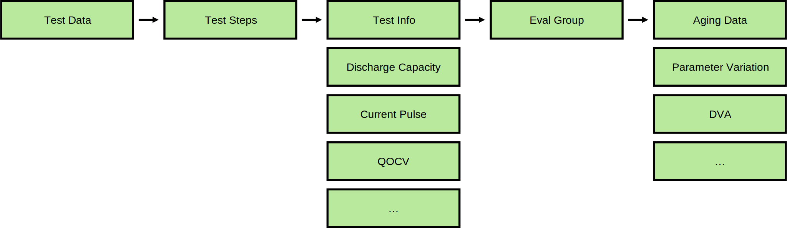
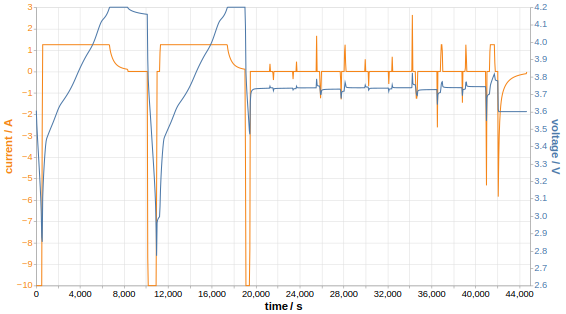
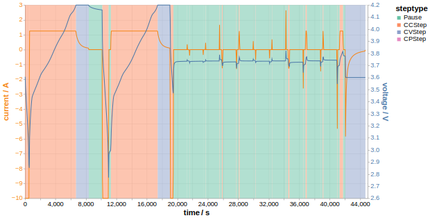
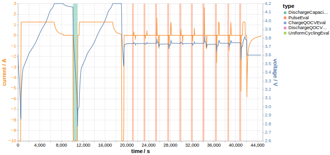

Structure
=========

Data analysis is divided into multiple steps that are described in more detail in the sections below.

Import test data
----------------

Segment data into steps
-----------------------

Find and evaluate patterns
--------------------------

Group data based on relevant criteria
-------------------------------------

Plot and export data
--------------------
